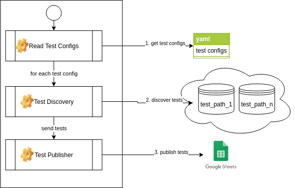

# test-reader
Project designed to identity automated test cases, based on yaml configuration and export it. This first version exports the test cases to google sheets. 
Its purpose is organize tests grouping by test types to help managing the tests created as well to be input to generate graphics and reports of tests distribution.

On version 1.0, the tests can be exported only to google spreadsheet. 




# Simple Environment Monitor System

## Installation
Using pip from source
 ```
 pip install git+https://github.com/amandaquaglio/test-reader.git@master
 
 ```
or clone from the source:
 ```
    git clone https://github.com/amandaquaglio/test-reader.git
    cd test-reader
    python setup.py install
 ```
## Usage

For installation using pip (PyPI or source). See environment variables config.
 ```
    test-reader-start 
 ```
For installation from the source, go to the source project path and run
 ```
    python bin/test-reader-start
 ```   
## Settings

### Environment Variables
| Variable                  | Description                                                                      | Required |
| ----------------          | -------------------------------------------------------------------------------- | ---------|
| APP_NAME                  | The tests will be saved on a sheet of a google spreadsheet. The name of sheet should correspond to APP_NAME, passed on this environment variable| yes |
| YAML_CONFIG_PATH          | This variable contains the path to yaml file, to describe your tests configuration / distribution, the paths you need. | yes |
| SPREADSHEET_ID            | The id of your Google spreadsheet. For more info, check on Google Spreadsheet settings.| yes |
| CREDENTIALS_JSON          | To be able to edit a spreadsheet, you need a credentials json generated on your Google account. For more info, check on Google Spreadsheet settings.| yes |

### Configuration on Google Spreadsheet
#### Getting your spreadsheet id
Create a new Spreadsheet in your Google Drive. On URL, your spreadsheet id will be located between  https://docs.google.com/spreadsheets/d/ and /edit. See the example below:
https://docs.google.com/spreadsheets/d/```1wSAkr0m4D-6YolQycW-aZBV3zvBz0aoxqRCZLDqGeqM```/edit#gid=0

#### Generating your credentials.json
1. Go to https://console.cloud.google.com/
2. Search for Google Drive API and enable it.
3. Search for Google Sheets API and enable it.
4. On Google Sheets API, go to Credentials menu.
5. Click on CREATE CREDENTIALS and select Service Account
6. Inform any service account name and click on Create.
7. You will be redirected to Service account permissions, click on Continue.
8. At this step, go to create key and click at button + Create Key.
9. Check if JSON option is select and click on Create. At this step, a json file will be downloaded. This json path should be informed at CREDENTIALS_JSON environment variable.

#### Associating permission to your spreadsheet
1. When you generates yout credentials json (usually it's called dark-balancer<random_value>.json), check that there is a field on json named client_email. Copy the value of this field.
2. Go to your spreadsheet and share it with this email. Note: You will need to give edition permission to this email.
3. Now you are ready to export your tests.
After generating your credentials.json, go to your spreadsheet. 


### YAML file
The test reader is based on an yaml configuration. This configuration will instruct the script where to find your tests, as well, how to identify it and what is it test type name.
This way, you can map the distribution and test types you need, and use it to many languages.

#### YAML attributes
| Attribute                 | Description                                                                      | Required |
| ----------------          | -------------------------------------------------------------------------------- | ---------|
| name                      | Used to map the name of test type. Example: Unit, Component, Integration... | yes |
| extends | It should have a name of another test configuration, used as parent. With this attribute, all attributes not informed will assume the value from parent. It is valid only for tests in the same path. You can't override path. | no |
| file_name_regex           | Used to define how the test file is named. It should be configured with a regular expression          | yes |
| file_content_contains           | Used to select only files that contains a line with an expression. In this case, you have to put the fixed string. (It does not work with regular expression)          | no |
| path                      | Path where you will find your tests.                                        | yes (if it has no extends) |
| test_rules / test_description_regex | Test rules will have the filters to identify a test case. The test_description_regex will have the regex to extract your description from a line. | yes (if it has no extends) |
| test_rules / test_description_strategy |  This attribute should have the strategy to get the test description based on test notation. If the description is  on the same line of the test notation, you will use SAME_LINE value. If it is on the next line, you should use NEXT_LINE value. | yes (if it has no extends) |
| test_rules / test_notation |  This attribute will inform if the regular expression to identify a new test in the file.| yes (if it has no extends) |


**Example 1: Simple configuration**
This example is configured to identify unit tests from Kotlin. 

Supposing the following file:
/home/amandaq/projects/my-android-app/app/src/test/java/SumTest.java
```
class SumTest {
  @Test
  fun `should sum two numbers`() {

  }
}
```

If you want to map, this test case as Unit, you should use the following yaml:
```
tests:
  -
    file_name_regex: .*Test\.kt$
    name: Unit
    path: /home/amandaq/projects/my-android-app/app/src/test/java
    test_rules:
      test_description_regex: "`(.+?)`"
      test_description_strategy: NEXT_LINE
      test_notation: "^@Test+$"
```
On this example, you will export:
| File Name | Test Case Name | Test Type |
|-----------|----------------|-----------|
|/home/amandaq/projects/my-android-app/app/src/test/java/SumTest.java|should sum two numbers|Unit|


**Example 2: More complex configuration**
This example is configured to identify unit and component tests from Kotlin. We are assuming that component tests are in the same directory of unit tests, but the only difference is that component tests has a line with expression ```@RunWith(AndroidJUnit4::class)```.

Supposing the following files:
/home/amandaq/projects/my-android-app/app/src/test/java/SumTest.java
```
class SumTest {
  @Test
  fun `should sum two numbers`() {

  }
}
```
/home/amandaq/projects/my-android-app/app/src/test/java/SumActivityTest.java
```
@RunWith(AndroidJUnit4::class)
class SumActivityTest {
  @Test
  fun `should show sum`() {

  }
}
```
If you want to map, those test cases as Unit and Component, you should use the following yaml:
```
tests:
  -
    file_name_regex: .*Test\.kt$
    name: Unit
    path: /home/amandaq/projects/my-android-app/app/src/test/java
    test_rules:
      test_description_regex: "`(.+?)`"
      test_description_strategy: NEXT_LINE
      test_notation: "^@Test+$"
  -
    name: Component
    extends: Unit
    file_content_contains: "@RunWith(AndroidJUnit4::class)"    
```
On this example, you will export:
| File Name | Test Case Name | Test Type |
|-----------|----------------|-----------|
|/home/amandaq/projects/my-android-app/app/src/test/java/SumTest.java|should sum two numbers|Unit|
|/home/amandaq/projects/my-android-app/app/src/test/java/SumActivityTest.java|should show sum|Component|

Note in the example above, that we used extends, because the types are in the path. If you have different tests in different paths, you can't use extension.

## Notes
This first version only exports to Google Spreadsheets. With this, you can create many view at Google Data Studio to manage your tests.
